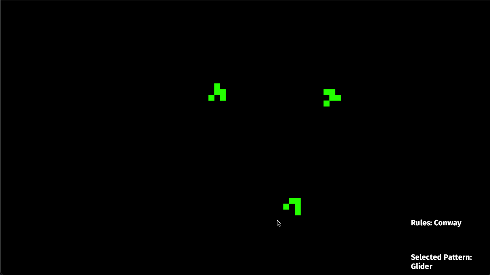

# Game of Life, in Bevy

This project aims to implement the Game of Life in Bevy.  As I approached this I was only considering Conway's Game of Life, but eventually implemented other rulesets (potentially incorrectly).

It's mostly used for me to expand my Bevy knowledge so if any of the rules or patterns are incorrect, please let me know and I'll attempt to correct them.

## ⚠️ Epilepsy Warning ⚠️

This project contains flashing lights, rapid screen changes, and other visual effects that may trigger seizures for people with photosensitive epilepsy. 

## Arguments

```text
--rules <RULES>  Rule set to use [default: conway]
    possible values:
    - conway
    - highlife
    - day-and-night
    - seeds
    - life-without-death
    - maze
    - anneal
    - diamoeba
    - two-by-two
    - morley
    - replicator
    - fredkin
    - stains
--speed <SPEED>  Simulation speed in ticks per second [default: 30.0]
--mode <MODE>    Display mode: color or image [default: color] [possible values: color, image]
```

## Examples
```sh
cargo run -- --help
cargo run -- --speed 1.0 # run 1 frame update per second
cargo run -- --rules maze --speed 1.0
cargo run -- --mode image # now it's just a bunch of frogs
```

Example: Conway's GOL


Example: Maze


Example: Run


## Usage

When it starts, the screen will only be dead cells.  Click to add a new pattern to the mix.

```text
up/down, w/s - changes the game ruleset
left/right, a/d - changes the pattern that clicking will trigger
escape - clears the screen (makes all cells dead)
```

## Structure

```text
assets/
src/
    args.rs - CLI argument handling
    config.rs - static configurations
    main.rs - main entrypoint
    patterns.rs - pattern abstraction where a combination of cells becomes a nameable pattern
    rules.rs - rule abstraction where combinations of alive/dead neighbors becomes a new alive cell
    state.rs - resources and components that control game state
    systems.rs - systems that run on a schedule to produce the game
Cargo.toml - dependencies and optimizations
rustfmt.toml - formatting for linter
```
